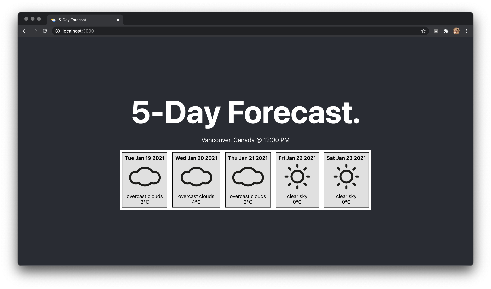

# Weather App (5-Day Forecast)

## Introduction
I created this to practice and learn React. It shows 5-day forecast of Vancouver, BC at 12:00PM. 

## Modules Used
- Create React App
- Material UI

## Possible Improvements
- Accurate weather data; OpenWeather provides 5-day forecast in the span of 3 hours. I could perhaps aggregate the data to provide min/max temperature of the day.
- Since I'm new to React, there could be some areas where I didn't follow the common code style or coding practices.

## Credits
- Weather icons were created by [Alessio Atzeni](https://www.alessioatzeni.com)
- Forecast data is provided by [OpenWeather](https://openweathermap.org/)
- Favicon was downloaded from [here](https://freepngimg.com/png/23525-weather-free-download/icon)
